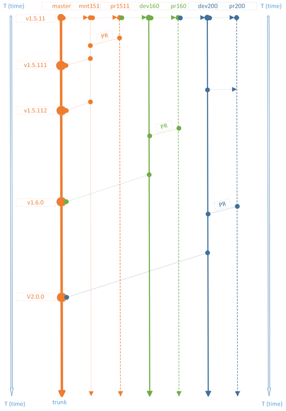

# Information for developers, contributors and collaborators

## v1.5.11 and onward

On release of v1.5.11 in the 30th of November, 2019 the project contained
* 37 [closed requirements](https://github.com/canne/dashboard_tactics_pi/issues?q=is%3Aissue+is%3Aclosed+label%3ARequirement+milestone%3Av1.5.11)
* 0 [open requirement](https://github.com/canne/dashboard_tactics_pi/issues?q=is%3Aissue+is%3Aclosed+label%3ARequirement+milestone%3Av1.5.11)

Starting from this holdpoint **the project enters into long term maintenance phase** for its main product, Dashboard-Tactics plug-in for OpenCPN v5.0.

The long term maintenance may continue to cover other minor versions of the OpenCPN v5.

The maintenance patch releases will be numbered v1.5.111, v1.5.112,...,v1.5.119.

Due to non-existing - or non-published - roadmap for OpenCPN v5 there is no possibility to define or predict additional requirements which could justify the continuous development phase.

Therefore the project is divided in three parts at this holdpoint:

1. **Long term maintenance**
2. **R&D based on v1.6 hypothesis**
  * Presuming that OpenCPN and plug-in API continues without any major changes or new plug-in supporting data retrieval and process intercommunicatio features are not introduced outside the API
  * In this hypothesis, data originating from a NMEA-2000 bus is not available
3. **R&D based on v2.0 hypothesis**
  * Presuming that OpenCPN and plug-in API evolve moderately in order to provide support for currently undefined data retrieval and process intercommunicatio features outside the API
  * In this hypothesis, data originating from a NMEA-2000 bus will be available

Each part above is divided into its own thread structure, presented by two `git` branches:

* Development and testing branch for the project owner(s)
* Staging branch for the solicited and unsolicited pull requests

> **Pull requests to master branch (trunk) are, for now, rejected**:

* `pr151` - Staging branch for pull requests for bug fixes in v1.5.11 - **no new features will be accepted in this branch**
  * Mandatory to be joined with a test use case and a test report, preferably in [canne.testquality.com](https://canne.testquality.com) - other formats accepted, of course
* `pr160` - v1.6 hypothesis staging branch for pull requests for major bug fixes changing the functionality or introducing new functions or suggesting major code reorganization
   * Mapping to an existing requirement (see above) or proposal for a new requirement is mandatory for any new feature proposed
   * Test use case and test report are optional but welcome
* `pr200` - v2.0 hypothesis staging branch for R&D any guessed or announced data retrieval and process intercommunication feature from OpenCPN or over it
   * **Free spirit R&D and new ideas goes here**
   * It would be appreciated that the ideas, however would become with some use case allowing the assembly of a test use case in the stage area if the pull request is accepted:
   * please do not get offended if the pull request will not get accepted - comments not guaranteed but an attempt will be made

>_Flying Fish_ branches can be created on simple demand for pull requests not meeting the above, or even below requirements:

Common automatic QA requirements (mandatory to pass) for all branches are
* [Codacy static code analysis](https://app.codacy.com/manual/petri38-github/dashboard_tactics_pi/dashboard)
* [Travis CI for pull requests](https://travis-ci.org/canne/dashboard_tactics_pi)
* [AppVeyor CI for Windows build](https://ci.appveyor.com/project/canne/dashboard-tactics-pi)
* [Travis CI for Linux and Mac builds](https://travis-ci.org/canne/dashboard_tactics_pi)

The below diagram depicts the branch schema starting from this holdpoint and provides a roadmap for future versions - without a time axis due to the lack of that information from the OpenCPN main project.

 [(zoom)](img/v1.5.11_holdpoint_threads.png)
